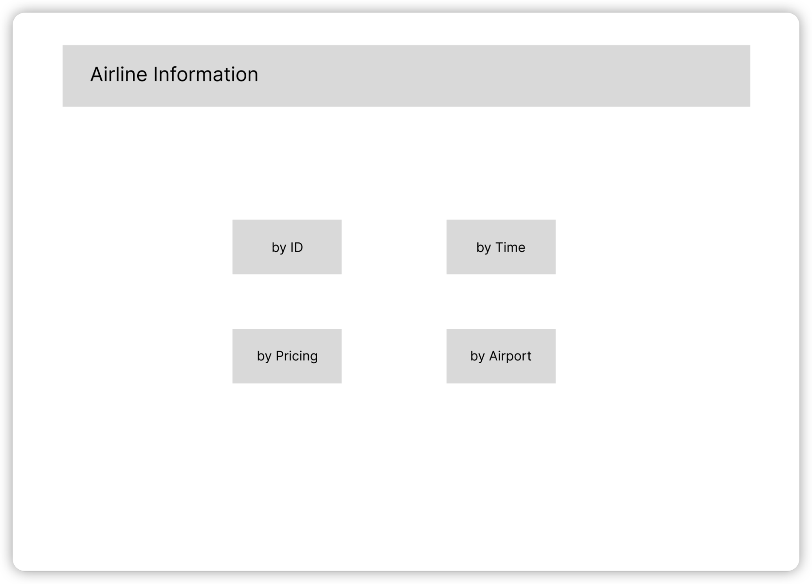
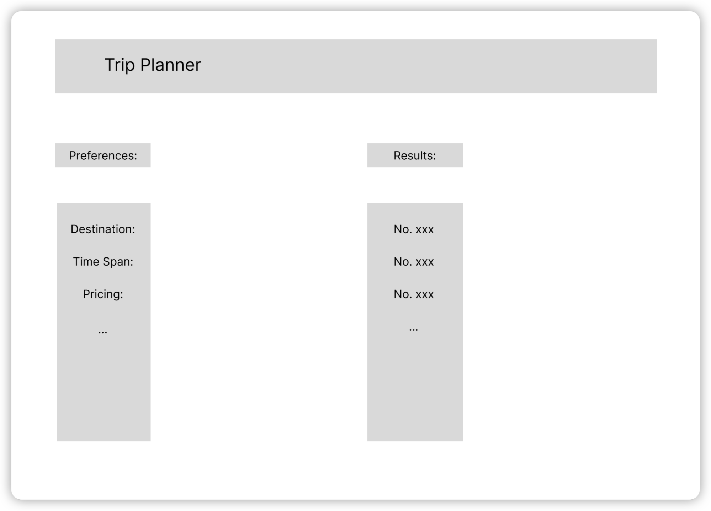

# Project Proposal

1. The data is mainly from openflights.org, possibly including some synthetic
   data for testing purposes. Potential entities and their attributes are as follows:

   ```
   Airport: AirportID, Name, IATA, ICAO, Latitude, Longitude, Altitude, CityID.
   Airline: AirlineID, Name, IATA, ICAO, Callsign, Active.
   Route: RouteID, AirlineID, Source airport ID, Destination airport ID, Stops.
   Plane: Name, IATA, ICAO.
   Country: iso_code, Name.
   City: City ID, Name, Country, Timezone.
   ```
   
2. Basic functions are trivial queries about certain entities, such as checking whether an airline has ongoing flights at a specific time, whether an airline is temporarily unavailable due to reasons like the pandemics, etc. Our data will be renewed every minute, so that the emergency cases such as flight delaying and cancellation will not affect our users much.

   Complex features include aggregation & grouping queries, such as finding all routes sourcing from a specific airport, finding routes longer than 5000 miles, and counting how many times a specific route are flown in certain year.

3. Creative components include trip planner and approximate search such as planning a trip with source and destination specified and finding possible routes to the nearest place if impossible to get to the destination directly.

## Project Title
Open-Flight-Database

## Project Summary
There are a lot of passengers searching for an appropriate flight every day, every hour, and even every second. Therefore, it is necessary to have a search engine to help each person around the world find their flights, which is exactly what our project Open_Flight_Database does. Open_Flight_Database is basically an integrated database system as well as a searching engine, which is capable of many functions with different features, such as checking airline statuses and finding the most nearest routes even under emergency situations, making travel plans for users based on their preferences ahead of time. Our main dataset is collected from the openflight website, and we will construct many relational data models with SQL operations to generate the whole system during the process.

## Description
Our project is an integrated database system that is capable of a variety of functionalities, from searching information to making plans.

Basic functions are trivial queries about certain entities, such as checking whether an airline has ongoing flights at a specific time, whether an airline is temporarily unavailable due to reasons like the pandemics, etc. 

Complex features include aggregation & grouping of queries, such as finding all routes sourcing from a specific airport, finding routes longer than 5000 miles, and counting how many times a specific route are flown in certain year.

Creative components include a trip planner and an approximate search such as planning a trip with source and destination specified and finding possible routes to the nearest place if impossible to get to the destination directly.


## Usefulness
There are existing airline databases out there, but mostly they only store information, and are unable to generate plans based on users’ changing preferences. Similarly, the existing trip planners typically do not have the ability to inquire about the airline data in depth. Therefore, our project with combined features is needed for users who are willing to search for the appropriate flight, but at the same time trying to make a flight plan ahead. This combined feature should be interested to many users.

## Realness
The data is mainly from openflights.org, possibly including some synthetic
data for testing purposes. Potential entities and their attributes are as follows:

    Airport: AirportID, Name, IATA, ICAO, Latitude, Longitude, Altitude, CityID.
    Airline: AirlineID, Name, IATA, ICAO, Callsign, Active.
    Route: RouteID, AirlineID, Source airport ID, Destination airport ID, Stops.
    Plane: Name, IATA, ICAO.
    Country: iso_code, Name.
    City: City ID, Name, Country, Timezone.

## Description of the functionality:
Basic functions are trivial queries about certain entities, such as checking whether an airline has ongoing flights at a specific time, whether an airline is temporarily unavailable due to reasons like the pandemics, etc. 

Complex features include aggregation & grouping queries, such as finding all routes sourcing from a specific airport, finding routes longer than 5000 miles, and counting how many times a specific route are flown in certain year.

## The low fidelity UI mockup:
  
  


## Project work distribution:
yg17: constructs the interfaces between different sections; uses web framework to build the platform that hold the database system; designs and implements the UIs.

yijinw4: obtains the real-world datasets from websites; creates corresponding relational models based on the data; determines the desired keys for each table.

mingw4: implements efficient functions to check for airline status; uses appropriate SQL operations between multiple tables to generate the correct search results.

paiz3: selects the airlines combinations that satisfy the users’ preferences; optimizes the outputs based on the airline data and statuses; handles the changing preferences accordingly.
