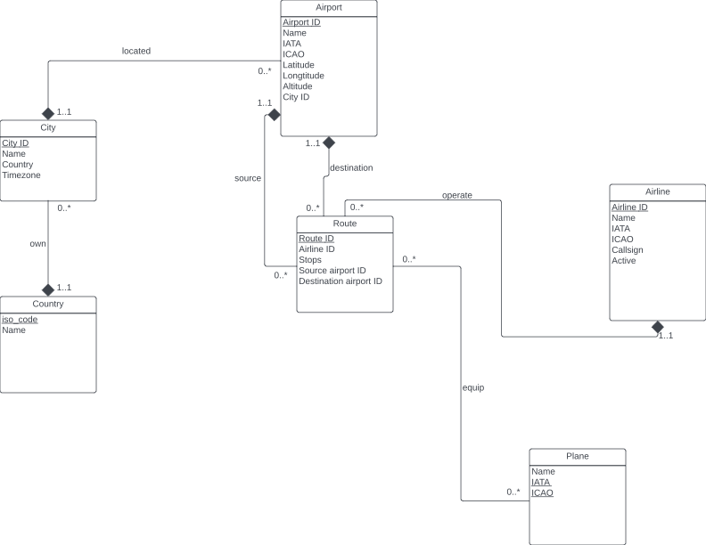

# Conceptual and Logical Database Design

## UML File

## Relational Schemas and Descriptions

**Country** (iso_code: CHAR(2) [PK], Name: VARCHAR(50))

* iso_code:   Unique two-letter ISO 3166-1 code for the country or territory.
* name:       Name of the country.

**City** (City ID: INT [PK], Name: VARCHAR(50), Country: CHAR(2) [FK to Country.iso_code], Timezone: REAL)

* City ID:    Unique identifier for this city.
* Name:       Full name of the city.
* Country:    Unique two-letter ISO 3166-1 code for the country or territory to which the city belongs.
* Timezone:   Hours offseet from UTC. Fractional hours are expressed as decimals.

**Airport** (Airport ID: INT [PK], Name: VARCHAR(50), IATA: CHAR(3), ICAO: CHAR(4), Latitude: REAL, Longitude: REAL, Altitude: REAL, City ID: INT [FK to City.City ID])

* Airport ID: Unique identifier for this airport.
* Name:       Name of airport.
* IATA:       3-letter IATA code. 
* ICAO:       4-letter ICAO code.
* Latitude:   Decimal degrees. Negative is South, positive is North.
* Longitude:  Decimal degrees. Negative is West, positive is East.
* Altitude: In feet.
* City ID:    Unique identifier for the city where the airport is located.

**Airline** (Airline ID: INT [PK], Name: VARCHAR(50), IATA: CHAR(3), ICAO: CHAR(4), Callsign: VARCHAR(50), Active: CHAR(1))

* Airline ID: Unique identifier for airline.
* Name:       Name of the airline.
* IATA:       2-letter IATA code.
* ICAO:       3-letter ICAO code.
* Callsign:   Airline callsign.
* Active:     "Y" if the airline is or has until recently been operational, "N" if it is defunct.

**Plane** (Name: VARCHAR(50), IATA: CHAR(3), ICAO: CHAR(4), (IATA, ICAO) [PK])

* Name:       Full name of the aircraft.
* IATA:       Unique 3-letter IATA identifier for the aircraft.
* ICAO:       Unique 4-letter ICAO identifier for the aircraft.

**Route**(Route ID: INT, Airline ID [FK to Airline.Airline ID], Stops: INT, Source airport ID: INT [FK to Airport. Airport ID], Destination airport ID: INT [FK to Airport.Airport ID])

* Route ID:   Unique identifier for route.
* Airline ID: Unique identifier for airline by whom the airline is operated.
* Stops:      Number of stops on this flight. "0" for direct.
* Source airport ID: Unique identifier for source airport.
* Destination airport ID:  Unique identifier for destination airport.

**Equip** (Route ID: INT [FK to Route.Route ID], IATA: CHAR(3), ICAO: CHAR(4), (IATA, ICAO) [FK to Plane.(IATA, ICAO)], (Route ID, IATA, ICAO) [PK])

* Route ID:   Unique identifier for route which equips the aircraft.
* IATA:       Unique 3-letter IATA identifier for the aircraft.
* ICAO:       Unique 4-letter ICAO identifier for the aircraft.

## Assumptions

- A Country may have multiple cities, but a City belongs to exactly one Country.
- A City may have multiple airports, but each Airport is located in exactly one City.
- An airport may be the source airport to multiple Routes, but a Route has exactly one source Airport.
- An airport may be the destination airport to multiple Routes, but a Route has exactly one destination Airport.
- An Airline may operate multiple Routes, but a Route is operated by exactly one Airline.
- A Route may equip multiple Planes, and each Plane can be equipped by multiple Routes.